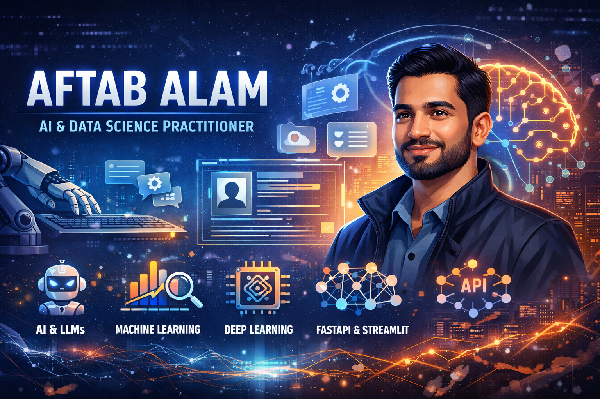

<h1 align="center">Hi 👋, I'm Aftab Alam</h1>

<p align="center">
  
</p>

<p align="center">
  
</p>

---

## 🌐 Connect With Me

<p align="center">
  <a href="https://www.linkedin.com/in/aftab-alam-2354bb31b/">
    
  </a>
  <a href="https://github.com/Coder-786hub">
    
  </a>
</p>

---

## 🏆 GitHub Stats

<p align="center">
  
</p>

<p align="center">
  
</p>

<p align="center">
  
</p>

---

## 🧠 About Me

I am an **AI & Data Science practitioner** focused on building **real-world, end-to-end AI systems**.
	
- Strong in Python & ML fundamentals  
- Hands-on with APIs, dashboards & agents  
- Learning & building with **LLMs and Generative AI**  
- Educator mindset — clarity over complexity  

---

## 🛠️ Tech Stack

<p align="center">
  
</p>

---

## 🚀 Highlighted Projects

### 🔹 AI-Powered LinkedIn Content Agent
<p>
  
</p>

- Automated LinkedIn post generation  
- LLM-based reasoning & prompt workflows  
- API-driven architecture  

---

### 🔹 Machine Learning Classification Systems
<p>
  
</p>

- End-to-end ML pipelines  
- Imbalanced dataset handling  
- Manual metric validation (TP, FP, FN, TN)  

---

### 🔹 Streamlit AI Dashboards
<p>
  
</p>

- Interactive ML & NLP applications  
- Real-time inference  
- Clean UI for demos  

---

### 🔹 Document Researcher AI
<p>
  
</p>

- PDF ingestion & semantic search  
- Vector-based retrieval  
- LLM-powered Q&A  

---

### 🔹 Drug Classification ML System
<p>
  
</p>

- Medical data classification  
- FastAPI backend + Streamlit UI  
- Production-style workflow  

---

## ⚙️ System Architecture

<p align="center">
  
</p>

```text
Frontend (Streamlit / Web UI)
        ↓
FastAPI Backend
        ↓
ML / DL Models
        ↓
LLMs / AI Agents
        ↓
Databases / Vector Stores

📊 Model Evaluation
<p align="center">  </p>

Accuracy

Precision

Recall

F1-Score

Confusion Matrix

📚 Learning Philosophy

Learning improves with clarity, not complexity.
I focus on understanding why systems work, not just how to run them.

👀 Profile Views
<p align="center">  </p>
⭐ Support

If you find this profile useful:

⭐ Star repositories

🍴 Fork & experiment

💬 Share feedback
